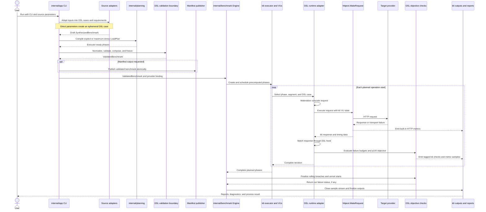

# Project brief

## Purpose

Demonstrate how to generate and execute k6 benchmarks directly from Go without
requiring JavaScript workload definitions.

Reuse k6's public Go APIs for execution, virtual users, built-in metrics, HTTP
requests, and outputs. Keep local compatibility code limited to functionality
that k6 exposes only through internal packages or that the selected report
renderer expects from k6's internal summary pipeline.

## Intended inputs

The eventual benchmark generator should combine:

- OpenAPI specifications for grouping logical endpoints
- consumer- and provider-side SLA/SLO specifications defining response-time,
  failure-rate, throughput, load-generation, threshold, and check requirements
- concrete consumer requests derived from consumer contracts such as PACT
- a segments file that varies load and activates or deactivates thresholds and
  checks during specific time periods

## Current scope

The current program executes a fixed HTTP GET workload or Pact interactions
using k6 shared iterations. It provides:

- configurable explicit VUs and iterations, agreement-derived load plans,
  request timeout, and explicit-load maximum duration
- k6-compatible JSON metric observations
- a sectioned k6-style terminal report covering every observed metric and Pact
  tag submetric
- a final table-oriented k6-reporter HTML summary generated in process
- an optional self-contained interactive dashboard HTML report generated from the same final metric stream
- an optional combined HTML report that uses k6-reporter as its visual base, embeds the unchanged interactive dashboard in an isolated graph region, and retains exhaustive local tables
- an optional deterministic benchmark manifest generated from the validated direct or Pact `SynthesizedBenchmark`
- a `rate==1` threshold on the current Pact response compatibility check
- an optional live dashboard
- CLI, metrics, HTTP behavior, report, and dashboard tests

The fixed workload is intentionally narrower than a general replacement for
the k6 CLI or JavaScript runtime.

## Package architecture requirements

- `internal/pact` is a source adapter. It may load and interpret Pact files and
  translate Pact examples, generators, matching rules, and semantics into the
  source-neutral DSL, including runtime behavior bound through DSL interfaces.
  It must not depend on k6 execution, metrics, OpenTelemetry, or reporting
  packages.
- `internal/dsl` is the pure domain model. It owns DSL types, normalization,
  cloning, serialization, and validation, plus source-neutral contracts for
  runtime materialization and matching. It must not perform HTTP requests,
  emit metrics, or depend on Pact, k6, OpenTelemetry, or reporting packages.
- Source adapters attach stable, indexable semantic information to cases and
  segments as DSL attributes. Attribute names and meanings belong to the
  source adapter; the DSL does not define Pact-specific attribute names.
- The Pact adapter namespaces its attributes as `pact.consumer_service`,
  `pact.provider_service`, `pact.endpoint`, `pact.interaction`, and
  `pact.provider_state`. These names remain consistent across manifests, k6
  tags, reports, OpenTelemetry metrics, and traces.
- `AttributeSet` provides name-based lookup and deterministic override
  semantics for this extensible data. Source-specific information is not
  modeled as fixed fields on the generic case type.
- DSL metadata carries non-indexed provenance and diagnostic information.
  `ReportSpec.GroupBy` selects which emitted attribute names split aggregate
  report series. Every selected name must be declared by a case or segment,
  and `MaxSeriesCardinality` constrains the resulting series count. Reporting
  configuration does not transfer source data.
- `internal/benchmark` owns execution of a validated DSL benchmark. It
  materializes requests, validates concrete requests, adapts them to HTTP,
  executes them through k6, matches concrete responses, and emits the metric
  and telemetry events produced by execution.
- The validated DSL is the only execution input. Direct-request CLI parameters
  are a frontend convenience that synthesizes an ephemeral benchmark and load
  plan; downstream packages must not model direct plans as a separate input
  kind.
- Benchmark execution propagates case and active-segment attributes to metrics
  and telemetry without interpreting source-specific names. Active-segment
  values override case values with the same name.
- OpenTelemetry integration belongs to the benchmark execution boundary.
  Its implementation may remain in a dedicated infrastructure package, but no
  source adapter, DSL, or reporting package may depend on it; application
  wiring must expose neutral benchmark configuration rather than leak
  OpenTelemetry types across package boundaries.
- `internal/report` consumes metric samples, finalized summaries, and dashboard
  event streams to produce terminal, HTML, combined, and live reports. It must
  not depend on Pact or other input adapters, execute requests, or own benchmark
  verification semantics.
- `internal/app` is the composition and CLI boundary. It parses user input,
  selects adapters, and wires benchmark execution to outputs, but does not own
  workload execution, source semantics, or report rendering.
- Dependencies point inward through the DSL and neutral execution/reporting
  contracts. Source adapters and reporting remain independent of one another.

### DSL-only architecture

The validated DSL carries all workload and load-plan semantics across the
execution boundary. The provider base URL is a runtime deployment binding, not
an alternative workload model.

```mermaid
flowchart LR
    subgraph Frontends["Frontend and source adaptation: internal/app"]
        Direct["Direct CLI parameters"]
        Pact["Pact adapter"]
        Agreement["Agreement adapter"]
        OpenAPI["Future OpenAPI adapter"]
        Compose["Compose draft benchmark"]

        Direct -->|"create ephemeral DSL case"| Compose
        Pact -->|"create DSL cases and hooks"| Compose
        Agreement -->|"create load and failure requirements"| Compose
        OpenAPI -.->|"create operations and expectations"| Compose
    end

    subgraph Domain["Source-neutral domain: internal/dsl"]
        Draft["SynthesizedBenchmark draft"]
        Validate["Normalize, validate, and freeze"]
        Validated["ValidatedBenchmark"]
        Manifest["Optional deterministic manifest"]
    end

    Planner["internal/planning<br/>Precompute executor-ready LoadPlan"]

    Compose --> Draft
    Draft --> Planner
    Planner --> Validate
    Validate --> Validated
    Validated --> Manifest

    subgraph Runtime["Generic execution: internal/benchmark"]
        Engine["Map load phases to k6 executors"]
        Runner["Select and materialize DSL requests"]
        HTTP["httpext.MakeRequest"]
        Verify["DSL response matching and objective checks"]

        Engine --> Runner
        Runner --> HTTP
        HTTP --> Verify
    end

    Validated --> Engine
    Binding["Runtime provider base URL"] --> HTTP

    subgraph Consumers["Outputs and telemetry"]
        Metrics["k6 metric samples and checks"]
        Telemetry["OpenTelemetry traces and metrics"]
        Reports["Console, JSON, HTML, dashboard, and combined reports"]

        Metrics --> Reports
    end

    Verify --> Metrics
    Verify --> Telemetry
```

Solid arrows are production data flow; the dashed OpenAPI path is planned. No
source-specific request type crosses the `ValidatedBenchmark` boundary.
`RequestTimeout` is currently still passed separately through `EngineConfig`
and `RunnerConfig`; moving that execution policy into the DSL is required to
make the sole-input boundary literal.

### Execution pipeline

## k6 integration requirements

- Use lib.Runner, lib.InitializedVU, and lib.ActiveVU for workload lifecycle.
- Use executor.SharedIterationsConfig and lib.ExecutionState for scheduling.
- Use metrics.RegisterBuiltinMetrics and the returned BuiltinMetrics objects.
- Give each VU its own lib.State, netext.Dialer, HTTP transport, TLS
  configuration, and cookie jar.
- Share only resources that k6 itself shares, such as the resolver and buffer
  pool.
- Use httpext.MakeRequest for HTTP execution, redirect accounting, response
  handling, error classification, expected-response behavior, and request
  metrics.
- Treat HTTP status codes 200 through 399 as expected by default.
- Emit applicable k6 system tags, including request method, URL, name, status,
  protocol, scenario, expected response, TLS information, and error details.
- Emit data_sent and data_received from each VU's netext.Dialer.IOSamples.
- Emit iterations and iteration_duration using k6's built-in metric objects.
- Preserve sample tags and metadata.
- Reset cookies between iterations by default while keeping cookie state
  isolated between VUs.
- Close idle per-VU connections when a VU activation ends.

## Load planning requirements

- Keep explicit `--vus` and `--iterations` for direct and Pact loads without agreements.
- Compile SLA rolling-window constraints into a deterministic maximum-stress schedule before execution.
- Scale operation ceilings exactly with `--load-scaling-factor` while retaining their time windows.
- Derive peak VUs from planned start overlap and the agreement's worst-case response duration.
- Keep the p100 response-time assumption separate from the executor timeout so slower responses remain observable and can breach p100 checks.
- Persist original requirements, effective constraints, assumptions, and executor-ready phases in schema-v3 manifests.
- Preserve exact rolling failure ceilings alongside load constraints, distinguishing aggregate transport failures including returned HTTP 504 gateway timeouts, other HTTP 5xx responses, and functional failures with optional source-derived status codes.
- Emit status-specific p100 objectives as k6 checks with `rate==1` and fail the run when a matching response exceeds its objective.
- Reject plans that exceed configured operation or generator-VU safety bounds, and fail runs with unmet starts.

## Pact contract requirements

- Interpret Pact HTTP interactions according to the semantics of their declared
  Pact specification version.
- Materialize each outgoing request from its Pact example and generators, then
  verify that the concrete request satisfies all applicable request matching
  rules before sending it.
- For interactions with provider state, add the provider-state value to the
  outgoing request. Configure the header name with
  `--pact-provider-state-header`; default it to
  `X-PACT-RequestedProviderState`.
- Verify each concrete provider response with the applicable Pact response
  matching rules and matching semantics, including rule selection, cascading,
  combination, and collection behavior; do not substitute plain equality or
  ad hoc matching where Pact defines different behavior.
- Reject unsupported Pact versions, interaction types, generators, matcher
  categories, or matcher variants explicitly instead of silently weakening the
  contract.
- Bind source-specific generators and matchers through Pact-independent DSL
  runtime hooks. `RequestSpec.Materialize` must return an independent concrete
  request, and `RequestSpec.Match` must evaluate an independently owned response
  snapshot.
  Requests without hooks use identity materialization and unconditional matching.
- Keep runtime hooks out of `BenchmarkManifest` JSON, but serialize concise
  descriptions of the values they generate and the response conditions they
  match. A decoded manifest does not regain executable runtime behavior.

## Output requirements

- Fan metric samples out through output.Manager.
- Keep JSON observations compatible with the k6 multiline JSON envelope.
- Build a k6-compatible `handleSummary(data)` model from public metric sinks,
  checks, and groups.
- Render a k6 v1.8.1-compatible terminal summary from that same finalized model,
  with metric categories, checks, groups, thresholds, units, alignment, and
  TTY-gated ANSI colors.
- Render the final report with the vendored k6-reporter v3.0.4 CommonJS bundle
  in k6's Goja-derived Sobek runtime.
- Keep the live dashboard disabled by default.
- Validate generated benchmark manifest, JSON, and HTML artifacts.
- Publish JSON and standalone HTML artifacts atomically after structural validation, preserving existing destinations when generation or validation fails.
- Publish the combined report atomically from finalized existing summary and dashboard state without adding another sample aggregator.
- Keep the combined artifact self-contained by removing the reporter template's external resource links, and isolate dashboard CSS and JavaScript from the reporter document.
- Synthesize direct and Pact inputs into a versioned, target-independent `SynthesizedBenchmark` before execution; keep bound target URLs and k6 runtime objects out of the serialized model.
- When `--benchmark-manifest-output` is set, serialize the exact validated
  benchmark data and runtime-behavior descriptions as a deterministic
  `BenchmarkManifest` with a trailing newline, validate it by round-trip
  decoding, and publish it atomically from a temporary file. Do not serialize
  executable runtime hooks.
- Surface output and artifact errors rather than silently ignoring them.

## Remaining differences from the k6 binary

1. The internal k6 scheduler is bypassed, so vus and vus_max are not emitted on
   k6's one-second ticker.
2. The JSON output is a local compatibility implementation. It buffers samples
   until shutdown instead of flushing every 200 milliseconds.
3. General threshold configuration, periodic evaluation, abort behavior, taint
   propagation, and non-check threshold-based process status are not
   implemented. Unmet enabled response checks, agreement failure budgets, and
   p100 objectives explicitly fail the run after outputs are finalized.
   Pact mode attaches `rate==1` to `checks{check:pact response matches}`;
   attached thresholds are evaluated in the final local summary. Agreement
   failure budgets are evaluated against their exact rolling windows, exposed
   as k6 checks with `rate==1`, and explicitly fail the run after a breach.
4. The canonical k6 summary collector and `handleSummary(data)` construction
   are internal. The final report uses a local compatibility model and a pinned
   third-party renderer.
5. lib.Runner references an internal summary type. The native runner therefore
   embeds lib.Runner and only safely overrides methods used by the direct
   executor path.
6. The fixed request does not set the k6 CLI user agent, so Go supplies its
   default user agent.
7. The fixed workload discards response bodies, while Pact mode retains them
   for response verification.
8. Cancellation can suppress data_sent and data_received because IOSamples are
   sent through metrics.PushIfNotDone with the canceled VU context.
9. The canonical terminal summary packages are internal. A local Go renderer
   follows k6 v1.8.1's current sectioned report and consumes the same finalized
   compatibility model as the HTML renderer. It displays all metrics observed
   by this workload rather than reproducing k6's compact/full collection
   filters, and it has no scenario report or progress UI. Those scope choices
   are not caused by the internal-package boundary. Remove the local renderer
   if k6 exposes this functionality publicly or the module moves into the k6
   source tree.
10. The Pact adapter materializes static HTTP examples but does not apply
    generators or verify the concrete request against request matching rules.
    Response verification is a partial local compatibility matcher: it does not
    implement all declared V2 through V4 matcher, combination, cascading,
    body-format, or collection semantics. The pinned pact-go public API can run
    whole-provider verification but does not expose per-exchange HTTP match
    results for the benchmark path.

## Next priorities

1. Emit vus and vus_max on a one-second loop using active and initialized VU
   counts.
2. Preserve per-VU I/O samples when an iteration is canceled.
3. Align fixed-request defaults, including the user agent and response-body
   policy.
4. Extend threshold configuration and evaluation beyond the implemented DSL
   failure-budget checks to other generated SLA/SLO inputs.
5. Replace shutdown-only JSON buffering with periodic streaming.
6. Keep the terminal compatibility renderer aligned with the pinned k6 version
   until a public reporting API is available.

## Testing expectations

- Assert observable behavior rather than private implementation details.
- Cover independent redirect trails and redirect cookie propagation.
- Cover expected and unexpected HTTP statuses.
- Cover network error tags and error codes.
- Cover per-VU cookie isolation.
- Cover iteration cancellation and planned-load deadline behavior.
- Cover required live-dashboard metrics and observable k6-reporter HTML
  content.
- Cover terminal metric categories, typed values, thresholds, checks, groups,
  ANSI colors, and Pact-tagged submetrics.
- Cover direct and Pact benchmark manifests, deterministic encoding, round-trip validation, target independence, default-disabled and explicit-empty behavior, output-path collisions, and preservation of existing destinations after failed publication.
- Cover request materialization and request and response verification with Pact
  compatibility fixtures for every supported specification version, matcher,
  rule combination, and generator.
- Keep JSON schema compatibility checks against the pinned k6 source.
- Target Go 1.27.0 and use its safe language and standard-library
  modernizations where they improve clarity or avoid allocation.
- Run `make check` before separate tests and as the final verification after Go
  changes; it owns formatting, imports, fixes, diagnostics, lint, and race tests.

## Working constraints

- Read README.md, this brief, and AGENTS.md before planning or editing.
- Preserve unrelated user changes in the worktree.
- Use the repository-local ignored `.scratch/` directory for temporary files,
  build caches, and tool caches instead of `/tmp` or `/private/tmp`.
- Prefer public k6 APIs and document unavoidable compatibility code.
- Keep benchmark configuration and CLI concerns separate from workload
  execution.
- Do not add an AI assistant as a commit co-author.
- Do not commit changes unless explicitly requested.
