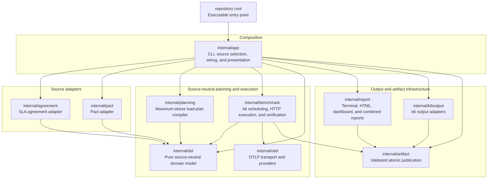

# k6 as a Go Library

This project demonstrates how to run HTTP load-testing workloads directly through k6's Go APIs, without executing a JavaScript test script, and in the process evaluating the current public available Golang interface of K6 by re-using as much as possible from the public Go APIs. Workloads can use a fixed GET request or the interactions in a directory of Pact files.

The ultimate goal for this effort is to demonstrate how we could generate K6 benchmarks directly from golang based on alternative inputs than JS. The input is as follows:

* **OpenAPI Specs**:
  * for grouping of logical endpoints and;
  * to be able to show what has and hasn't been benchmarked.
* **SLA / SLO agreements records**:
  from both the consumer and provider side stating required/expected response times, failure rates, and throughputs for load-generation, thresholds, checks,
* **Automatic request synthesis**:
  Specific requests per consumer based on the interactions on Consumer Contracts (i.e. PACT) to use as basis for the concrete requests.
* **Declarative scenarios**:
  A segments file containing a list of segments, each can be used to tune the above input for given time periods to allow for thresholds/checks to modify (deactivate, scale) in certain periods, and to change the load by a factor in a period.

The goal is to reuse k6's execution engine, virtual-user model, built-in metrics, HTTP tracing, and output lifecycle while keeping benchmark configuration and the Cobra CLI separate from the workload implementation. A run produces k6-compatible JSON observations, a sectioned k6-style terminal report, a table-oriented HTML summary rendered directly with k6-reporter, optional standalone and combined interactive reports, an optional deterministic benchmark manifest, and an optional live streaming dashboard.

The project also serves as an exploration of k6's current public Go API boundaries. Local compatibility code is kept where k6 functionality is internal and therefore cannot be imported by an external Go module.

Development and the source-mounted benchmark runner require Go 1.27.0.

## Code layout

- the repository root contains only the executable entry point
- `internal/app` owns CLI and environment configuration, source selection, output wiring, result presentation, and cross-package integration tests; it does not execute workloads
- `internal/dsl` is the pure source-neutral model and owns types, normalization, cloning, serialization, validation, and runtime materialization and matching contracts
- `internal/pact` loads and interprets Pact files and translates Pact examples, generators, matchers, and semantics into the DSL; it does not execute requests or render reports
- `internal/benchmark` owns the validated synthesized benchmark, composition, manifest publication, selection, k6 scheduling and virtual users, HTTP execution, response verification, metrics, and telemetry emission
- `internal/otel` implements OTLP transport and providers behind the benchmark execution boundary
- `internal/report` consumes metrics and finalized data streams to generate terminal, k6-reporter, dashboard, combined, and live reports
- `internal/artifact` and `internal/k6output` own validated atomic publication and k6 output adapters

Arrows in the diagram point from a package to the internal package it depends
on. The root executable depends only on the application composition boundary.



As observable through the used language, this project has been created with heavy assistance from Codex to find the proper integration points.

## Comparison with the k6 binary

This project reuses substantial parts of k6, but it is not yet a drop-in semantic replacement for a `k6 run`. It currently uses:

- `lib.Runner`, `lib.InitializedVU`, and `lib.ActiveVU` for the workload lifecycle
- `executor.SharedIterationsConfig` and `lib.ExecutionState` for scheduling
- `metrics.RegisterBuiltinMetrics` and the returned `metrics.BuiltinMetrics` pointers
- per-VU `lib.State`, `netext.Dialer`, HTTP transport, TLS configuration, and cookie jar
- `netext.Dialer.IOSamples` for transferred-byte metrics
- `httpext.MakeRequest` for redirects, response handling, error classification, and HTTP metrics
- `metrics.D`, `metrics.TagsAndMeta`, and `metrics.PushIfNotDone`
- `metrics.NewSink`, trend resolvers, and `lib.Group` for the local summary compatibility model
- `output.Manager` and `output.SampleBuffer` for output fan-out
- xk6-dashboard's public output for the live dashboard and its pinned embedded assets for the offline dashboard report
- a local Go compatibility renderer following k6 v1.8.1's internal terminal summary
- the pinned k6-reporter v3.0.4 CommonJS bundle for the final HTML document, executed by k6's Goja-derived Sobek runtime

Production metric samples use k6's built-in metric objects rather than recreating metric names. The terminal and HTML reports consume the same finalized local summary model.

### Benchmark manifest

`--benchmark-manifest-output PATH` is optional and disabled by default. Every run executes a validated `SynthesizedBenchmark`; direct CLI request parameters are only a frontend that creates this DSL model ephemerally. When manifest output is provided, that same model is atomically published as a deterministic, versioned JSON `BenchmarkManifest` ending in a newline. Schema version 3 uses source-neutral `attributes`, `metadata`, `groupBy`, SLA load requirements, and executor-ready load phases. Source adapters own their attribute names; `groupBy` only selects which declared attributes split aggregate report series. The manifest also contains request paths, queries, expectations, checks, thresholds, segments, provenance, and human-readable descriptions of runtime request generation and response matching. It contains no provider base URL, executable callbacks, or k6 runtime objects. A decoded manifest therefore uses identity request materialization and unconditional response matching until a source adapter rebinds runtime behavior. Round-trip validation occurs before rename, so generation or validation failure leaves an existing destination unchanged.

Pact-owned attributes use the `pact` namespace: `pact.consumer_service`,
`pact.provider_service`, `pact.endpoint`, `pact.interaction`, and
`pact.provider_state`. The same names appear in manifests, k6 tags, reports,
OpenTelemetry metrics, and traces.

`RequestSpec.Materialize` produces an independent request immediately before the HTTP adapter constructs the wire request. `RequestSpec.Match` evaluates an independently owned response snapshot after the request completes. Source adapters bind these operations through Pact-independent function types. A hand-written request with no bound behavior is unchanged by materialization and matches every response.

An empty path disables the artifact, `-` is rejected, and collisions with JSON, HTML, dashboard, or combined output paths are rejected. A successful run prints `Benchmark manifest: PATH`.

JSON metrics and the standalone k6-reporter HTML report are also rendered to temporary files, structurally validated, and atomically renamed. Failed generation or validation leaves an existing destination unchanged.

### Metric coverage

| Metric category | Current behavior |
|---|---|
| `http_reqs`, `http_req_failed`, and all HTTP phase metrics | Emitted |
| `data_sent`, `data_received` | Emitted |
| `iterations`, `iteration_duration` | Emitted |
| `dropped_iterations` | Emitted conditionally by the shared-iterations executor |
| `vus`, `vus_max` | Not emitted because the internal k6 scheduler is bypassed |
| Checks | Pact response checks are emitted for status, headers, cookies, and body matching; Pact mode applies `rate==1` to `checks{check:pact response matches}` |
| Groups | The root group tag is emitted; named and nested groups are not modeled |
| WebSockets and gRPC | Not implemented |

### Known differences

The labels below distinguish an inability to reuse k6's canonical implementation from behavior that is simply not implemented here. An **internal-package limitation** means Go prevents this external module from importing the relevant k6 package; it does not mean compatible behavior cannot be implemented locally with public APIs.

1. **Internal-package limitation: VU gauges are absent.** The public executor is invoked directly, bypassing `internal/execution`'s scheduler, which emits `vus` and `vus_max` on a one-second ticker. Public execution-state counts and `BuiltinMetrics` fields are sufficient to implement an equivalent local loop, but the canonical loop cannot be reused.

2. **Internal-package limitation: the JSON output is a compatibility implementation.** k6's JSON output constructor and envelope types live under `internal/output/json`. This project reproduces the wire format using exported metric types, buffers observations until shutdown instead of flushing every 200 milliseconds, and does not serialize the Pact submetric threshold into the metric envelope. The periodic flusher is public, so the cadence can be reproduced locally even though the canonical JSON output cannot be reused. The tests cover structural compatibility rather than every serialized value and streaming behavior.

3. **Not internal: the final HTML renderer is a pinned third-party component.** The table-oriented report comes from the vendored k6-reporter v3.0.4 CommonJS bundle, not from k6 or xk6-dashboard. The application evaluates it in Sobek, k6's Goja-derived JavaScript runtime, instead of adding a second JavaScript engine. Reporter upgrades require deliberately updating the bundle, checksum, compatibility tests, and vendored MIT license. The generated default-theme document references external font and icon assets when viewed, although report generation itself is offline.

4. **Internal-package limitation: the external runner API cannot be implemented safely.** The exported `lib.Runner` interface references a type from `internal/lib/summary`, which an external Go module cannot name. The native runner therefore embeds `lib.Runner` and overrides only the methods used by the direct executor. Calling another promoted lifecycle method would be unsafe.

5. **Not internal: HTTP request defaults still differ.** The native workload bypasses the JavaScript HTTP parsing layer, so it does not set the k6 CLI's `Grafana k6/<version>` user agent and Go supplies its default user agent instead. The fixed workload discards response bodies, while Pact mode retains them for response matching. Public APIs are sufficient to align these choices.

6. **Not internal: cancellation can suppress transferred-byte samples.** The native VU sends `netext.Dialer.IOSamples` through `metrics.PushIfNotDone` with the canceled VU context, so `data_sent` and `data_received` may be omitted for an interrupted iteration. k6 emits those I/O deltas before deciding whether the iteration completed. The required dialer samples and output channel are public, so this is a local lifecycle difference.

7. **Internal-package limitation: the canonical threshold lifecycle is absent.** k6's threshold engine lives under `internal/metrics/engine`. Although metric and threshold definitions are exported, the engine that initializes tagged submetrics, evaluates thresholds periodically and at shutdown, aborts runs, and propagates taint cannot be reused. Pact mode attaches a fixed `rate==1` threshold to `checks{check:pact response matches}`, and the local summary evaluates and reports its final state. An unmet Pact response check makes `run` return an error and the executable exit non-zero. DSL failure budgets and p100 objectives likewise emit k6 checks with `rate==1` and fail the run after a breach. The CLI does not yet accept general threshold configuration; generic periodic evaluation, abort-on-failure behavior, and non-check threshold process status are not implemented.

8. **Internal-package limitation: the terminal report uses a local compatibility renderer.** The canonical collector, summary model, report adapter, and formatter live in `internal/output/summary`, `internal/lib/summary`, and `internal/js`, so this external Go module cannot import them. `internal/report/console.go` therefore follows the current k6 v1.8.1 `summary.js` presentation locally: `THRESHOLDS` and `TOTAL RESULTS` sections, protocol-oriented metric categories, globally aligned metric and tagged-submetric names, counter/rate/gauge/trend formatting, duration and byte units, checks and groups, Unicode status symbols, and TTY-gated ANSI colors. Pact tag combinations appear as k6-style submetric rows, including the deliberately failed check and request. This implementation consumes the same finalized model as the HTML renderer and should be removed if k6 exposes a public terminal reporter or this code moves inside the k6 module tree. Showing every observed metric instead of reproducing compact/full collection, and omitting scenario sections and the progress UI, are current project-scope choices rather than consequences of the `internal` rule.

9. **Partly internal: the HTML report uses a local `handleSummary` compatibility model.** `--html-output` now produces the table-oriented k6-reporter document with metric-type tables, trend statistics, final threshold state, and checks/groups. k6's canonical legacy summary and `handleSummary(data)` construction live in `internal`, so the project recreates that public data contract using observed samples, exported sinks, and exported group types. Pact runs add full tag-combination metric rows so the deliberately failed interaction is identifiable in the report. The aggregate model does not preserve per-sample metadata: detailed `pact_mismatch` text remains in the JSON output, while the HTML report shows the failed tagged `checks` and `http_req_failed` rows. This metadata loss follows from aggregation, not from Go's `internal` rule.

10. **Not internal: named and nested groups are not modeled.** The root `group` tag is emitted, but the workload does not create a named group hierarchy. k6's group and tag types are public, so this is a local workload-modeling choice rather than an import restriction.

11. **Partly internal: the offline dashboard report has a local event adapter.** `--dashboard-output` uses the public xk6-dashboard assets and k6 metric sinks, but the dashboard output's canonical report builder is private to the xk6-dashboard module. The local adapter therefore creates the pinned event stream and final snapshots itself. The graph's one-tag limitation is surfaced as a diagnostic; the table, JSON, and combined reports retain the complete tag combinations. `--combined-output` uses the k6-reporter document as its visual base, embeds the unchanged dashboard as an isolated graph application, and adds project-rendered semantic tables from the finalized local summary without introducing another metric aggregator.

12. **Internal-package limitation: OpenTelemetry output and tracing require local compatibility code.** k6's canonical metric output and trace-provider configuration live in `internal/output/opentelemetry` and `internal/lib/trace`. This project uses k6's public output lifecycle and the OpenTelemetry Go SDK to export equivalent metrics, and instruments the generic benchmark-interaction lifecycle locally. Calling `httpext.MakeRequest` does not add tracing automatically: k6's JavaScript HTTP path delegates to the same request machinery and does not consume `lib.State.TracerProvider`. Metric attributes include a fixed safe k6 set plus the benchmark's configured `groupBy` attributes, while metrics and traces share `benchmark.run_id` for correlation. This code should be removed if k6 exposes equivalent public APIs or the project moves inside the k6 module tree.

The `internal` boundary prevents direct reuse for items 1, 2, 4, 7, 8, 12, and parts of items 9 and 11. Items 3, 5, 6, and 10, plus aggregate metadata loss in item 9 and the dashboard graph model in item 11, are independent of that boundary. Further alignment should start with the locally implementable VU loop, I/O ordering, request defaults, and group modeling. JSON streaming, the full threshold lifecycle, canonical compact/full collection, and exact canonical summary data still require larger compatibility implementations around inaccessible packages.

Run the benchmark with:

```sh
go run '.' run \
  --url 'http://localhost:8080/headers' \
  --vus 2 \
  --iterations 2000 \
  --request-timeout 10s \
  --max-duration 30s \
  --json-output 'metrics.json' \
  --html-output 'report.html' \
  --dashboard-output 'dashboard.html' \
  --combined-output 'combined.html' \
  --benchmark-manifest-output 'benchmark-manifest.json'
```

For agreement-derived stress, replace `--vus`, `--iterations`, and
`--max-duration` with
`--agreements example_agreements.yaml`. The planner preserves each rolling
window, schedules the maximum permitted operation starts, derives peak VUs
from the agreement's worst-case response duration, and writes both the source
requirements and executor-ready phases to the benchmark manifest.
The response-time `p100` remains the concurrency-sizing assumption, while the
configured request timeout is the executor limit so responses slower than the
agreement can complete and fail their k6 checks instead of being canceled at
the objective boundary.
`--load-scaling-factor` scales only operation amounts: `1` uses the agreement,
`10` requests ten times its load, and `0.1` requests ten percent while retaining
the original windows. `--max-planned-operations` and `--generator-max-vus` are
safety bounds.

### Agreement examples

The agreement loader accepts JSON as well as YAML. Each example below can be
saved as `agreements.json` and passed with `--agreements agreements.json`. They
use the default direct-request `/headers` endpoint and differ only in the load
shape permitted by their intersecting rolling windows. The equivalent YAML
files are available under [`examples/agreements`](examples/agreements).

#### Approximately fixed load

The 100 ms window permits only one operation start at a time, while the minute
window caps the sustained rate at 600 starts. Both constraints represent ten
starts per second, but the short window prevents those starts from being
concentrated into a large burst.

```json
{
  "agreements": [
    {
      "consumer": "fixed-load-client",
      "provider": "example-api",
      "slo": [
        {
          "endpoint": {
            "host": "localhost",
            "method": "GET",
            "pathTemplate": "/headers"
          },
          "loadConstraints": [
            {
              "amount": 1,
              "per-time-unit": "100ms"
            },
            {
              "amount": 600,
              "per-time-unit": "minute",
              "permittedFailures": [
                { "category": "transport", "amount": 5 },
                { "category": "http_5xx", "amount": 3 },
                {
                  "category": "functional",
                  "amount": 6,
                  "statusCodes": ["400", "404", "409", "422"]
                }
              ]
            }
          ],
          "responseTimes": [
            {
              "statusCode": 200,
              "mean": "100ms",
              "median": "90ms",
              "p99": "200ms",
              "p100": "250ms"
            },
            { "statusCode": "5xx", "p100": "250ms" }
          ]
        }
      ]
    }
  ]
}
```

#### Fixed load with small bursts

The 200 ms window allows two starts together, producing small bursts with a
local ceiling of ten starts per second. The 570-start minute window lowers the
long-running average to at most 9.5 starts per second.

```json
{
  "agreements": [
    {
      "consumer": "lightly-bursty-client",
      "provider": "example-api",
      "slo": [
        {
          "endpoint": {
            "host": "localhost",
            "method": "GET",
            "pathTemplate": "/headers"
          },
          "loadConstraints": [
            {
              "amount": 2,
              "per-time-unit": "200ms"
            },
            {
              "amount": 570,
              "per-time-unit": "minute",
              "permittedFailures": [
                { "category": "transport", "amount": 5 },
                { "category": "http_5xx", "amount": 3 },
                {
                  "category": "functional",
                  "amount": 6,
                  "statusCodes": ["400", "404", "409", "422"]
                }
              ]
            }
          ],
          "responseTimes": [
            {
              "statusCode": 200,
              "mean": "100ms",
              "median": "90ms",
              "p99": "200ms",
              "p100": "250ms"
            },
            { "statusCode": "5xx", "p100": "250ms" }
          ]
        }
      ]
    }
  ]
}
```

#### Spiky within an hour, normal over longer periods

The one-second constraint permits bursts of up to 100 starts. The hour and day
constraints cap the totals at 3,600 and 86,400, respectively, so short spikes
remain possible while the longer-term allowance averages one start per second.

```json
{
  "agreements": [
    {
      "consumer": "spiky-client",
      "provider": "example-api",
      "slo": [
        {
          "endpoint": {
            "host": "localhost",
            "method": "GET",
            "pathTemplate": "/headers"
          },
          "loadConstraints": [
            {
              "amount": 100,
              "per-time-unit": "second"
            },
            {
              "amount": 3600,
              "per-time-unit": "hour",
              "permittedFailures": [
                { "category": "transport", "amount": 20 },
                { "category": "http_5xx", "amount": 18 },
                {
                  "category": "functional",
                  "amount": 36,
                  "statusCodes": ["400", "404", "409", "422"]
                }
              ]
            },
            {
              "amount": 86400,
              "per-time-unit": "day"
            }
          ],
          "responseTimes": [
            {
              "statusCode": 200,
              "mean": "150ms",
              "median": "125ms",
              "p99": "400ms",
              "p100": "500ms"
            },
            { "statusCode": "5xx", "p100": "500ms" }
          ]
        }
      ]
    }
  ]
}
```

These values are upper bounds, not required baselines. The maximum-stress
planner schedules the earliest and largest batches permitted by every active
window. The generated manifest therefore exposes the exact burst pattern before
load generation begins.

Each rolling load constraint can also contain `permittedFailures`. Their
integer `amount` inherits the load constraint's window, making the budget exact
and its percentage derivable without floating-point input. The `transport`
category combines all request-level transport failures and returned HTTP 504
gateway timeouts without requiring agreements on lower-level failure kinds.
The general HTTP 5xx category excludes 504 to prevent double counting. Functional
budgets may list explicit non-2xx, non-5xx
`statusCodes`; a future OpenAPI adapter can populate these from declared error
responses. An omitted budget is unspecified, while `amount: 0` explicitly
permits no failures of that category. These budgets are recorded in the DSL and
manifest. For each budget, k6 receives a check on every applicable operation.
Permitted failures pass that check; the first failure beyond the rolling ceiling
fails it, which breaches an attached `rate==1` threshold. A breach also makes the
run fail after execution, independently of the unavailable internal k6 threshold
engine.

Status-specific `p100` response-time objectives also emit k6 checks with
`rate==1`. Each returned response matching the objective's status code passes
only when its k6 HTTP request duration is at or below the declared `p100`.
Mean, median, and p99 remain aggregate objectives and are not represented as
per-response Boolean checks.

`--html-output` is generated in the Go process from the collected summary. Runtime generation does not invoke the k6 CLI, Node.js, a subprocess, or a network import; the pinned reporter bundle and license are stored under `third_party/k6-reporter/v3.0.4`.

`--dashboard-output` is optional and writes the self-contained interactive xk6-dashboard report from the same finalized sample stream. It is disabled when omitted. Graph data is aggregated into populated periodic snapshots, including the final partial interval, so the offline time series retains the run's intermediate points. The dashboard graph model represents one configured grouping attribute at a time; Pact runs retain full attribute combinations in the table and JSON reports and emit a diagnostic for combinations that cannot be represented in the graph.

`--combined-output` is optional and writes one self-contained k6-reporter-based document with interactive graphs plus exhaustive local tables for base metrics, arbitrary tag combinations, named and nested groups, checks, threshold definitions and results, and visible graph diagnostics. It does not require `--dashboard-output`; when both are supplied, both artifacts use the same dashboard event payload. The dashboard runs inside an embedded frame so its global styles cannot override the reporter design. External font, icon, favicon, and preconnect resources from the reporter template are removed from the combined artifact so it remains usable offline.

The graphs embed xk6-dashboard v0.8.1 and xk6-dashboard-assets v0.1.2 under AGPL-3.0. The surrounding report embeds k6-reporter v3.0.4 under MIT. The combined document includes visible version, license, and source notices for both. Distribution owners should review the corresponding-source and notice mechanism for their packaging context.

Use `--dashboard` to host the live dashboard during the run. It is disabled by default.

Enable OTLP metrics with `--out opentelemetry` and configure the exporter with
the `K6_OTEL_*` environment variables. Enable traces independently with
`--traces-output`; HTTP/protobuf and gRPC are supported:

```sh
K6_OTEL_EXPORTER_PROTOCOL='http/protobuf' \
K6_OTEL_HTTP_EXPORTER_ENDPOINT='localhost:4318' \
K6_OTEL_HTTP_EXPORTER_INSECURE='true' \
go run '.' run \
  --url 'http://localhost:8080/get' \
  --out 'opentelemetry' \
  --traces-output 'otel=http://localhost:4318,proto=http'
```

Exporter configuration, flush, export, and shutdown errors are returned by the
run. Metric attributes retain the benchmark's configured stable grouping
attributes but exclude raw URLs, error text, IP addresses, and other unbounded
tags. Each run adds the
same `benchmark.run_id` resource attribute to metrics and traces.

To load Pact interactions, pass the provider base URL with `--pact-provider-url` and a directory containing Pact JSON files with `--pacts-dir`:

```sh
go run '.' run \
  --pact-provider-url 'http://localhost:8080' \
  --pacts-dir 'testdata/pacts' \
  --vus 2 \
  --iterations 2000 \
  --json-output 'metrics.json' \
  --html-output 'report.html' \
  --dashboard-output 'dashboard.html' \
  --combined-output 'combined.html'
```

Pact request paths and queries are resolved against `--pact-provider-url`. The configured URL always supplies the destination scheme, host, and port; any `Host` header in an interaction is ignored. An optional path in the provider URL is used as a prefix for every Pact request path.

The two example contracts in `testdata/pacts` are based on httpbin's local specification at `http://localhost:8080/spec.json`. They cover GET query reflection, JSON POST reflection, JSON and text bodies, custom response headers, a cookie-setting redirect, and 204 and 418 status responses. One interaction deliberately calls `/status/200` while expecting status 300 so the generated metrics and report include a Pact verification failure. Integration tests serve the contracts with `github.com/mccutchen/go-httpbin/v2/httpbin` instead of duplicating httpbin route definitions. The same integration tests and the Compose E2E workflow also run them against `pactfoundation/pact-stub-server:0.7.1`, configured with `X-PACT-RequestedProviderState`. The stub returns the contract-defined 300 response, so it must verify every interaction successfully; the deliberate mismatch is expected only against go-httpbin.

Each iteration sends one Pact interaction, cycling through all loaded interactions. A failed response check is recorded in the built-in `checks` metric and breaches `rate==1` on the `checks{check:pact response matches}` submetric. The run finishes output generation, then returns an error so the executable exits non-zero. Transport failures remain HTTP request failures and also fail an enabled response check when the response cannot satisfy it.

The Pact adapter uses the public `pact-go` specification-version and provider-state types. The SDK's public API does not expose individual parsed interactions or match results, so the repository includes the small JSON compatibility layer needed to connect Pact files to k6's per-request metrics.
